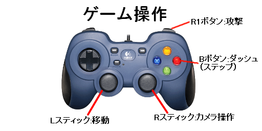

# NearAndroid 

河原電子ビジネス専門学校  
ゲームクリエイター科2年 豊岡 大  

# 目次

1. [作品概要](#anchor1)  
2. [操作説明](#anchor2)  
1. [改造したエンジンのコード](#anchor4)  
2. [川瀬式ブルーム](#anchor5)  

# 作品概要

- **NearAndroid(二アーアンドロイド)**  
キャラクターを操作してウェーブ形式で襲い掛かってくる敵を倒すゲームです。

- **使用ゲームエンジン**  
学校内製エンジン(DirectX12)を改造して制作  

- **使用ツール**  
Visual Studio 2022  
3ds Max 2022  
Adobe Photoshop Elements 2021  
Git Hub  

- **使用言語**  
C++  
HLSL  

- **開発環境**  
Windows10  
DirectX12  

- **制作人数**  
1人  

- **開発期間**  
2022年9月～2023年2月

# 操作説明

# 改造したエンジンのコード

## 豊岡 大

- MeshParts.cpp、MeshParts.h  
  速度マップ描画用の定数バッファ追加。
- Model.cpp、Model.h  
  速度マップ描画用の定数バッファを更新する処理追加。

# 川瀬式ブルーム

通常シーンをオフスクリーンレンダリング後、輝度抽出を行い、
ガウシアンブラーとダウンサンプリングを繰り返して複数枚のテクスチャを作成して、  
複数枚のテクスチャの平均を取って加算合成することで光のあふれを表現できるようになっています。  
**通常シーン**  
  
**輝度抽出**  
  
**ガウシアンブラーとダウンサンプリング（これを複数回繰り返す）**  
  
**加算合成後**  
  

