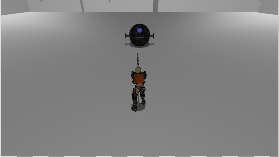

# Near:Android 

河原電子ビジネス専門学校  
ゲームクリエイター科2年 豊岡 大  

# 目次

### 1. [作品概要](#anchor1)  
### 2. [操作説明](#anchor2)  
### 3. [ゲーム概要](#anchor3)
### 4. [改造したエンジンのコード](#anchor4)  
### 5. [PBR(Physics Base Rendering)](#anchor5)  
### 6. [川瀬式ブルーム](#anchor6)  
### 7. [ディザリング](#anchor7)

# 作品概要

## **Near:Android(二アーアンドロイド)**  
キャラクターを操作してウェーブ形式で襲い掛かってくる敵を倒すゲームです。
- **使用ゲームエンジン**  
学校内製エンジン(DirectX12製)を改造して制作  

- **使用ツール**  
Visual Studio 2022  
3ds Max 2022  
Adobe Photoshop Elements 2021  
Git Hub  

- **使用言語**  
C++  
HLSL  

- **開発環境**  
Windows10  
DirectX12  

- **制作人数**  
1人  

- **開発期間**  
2022年9月～2023年2月

# 操作説明

# ゲーム内要素
## 連続攻撃
プレイヤーは最終段含め五段攻撃をすることが可能でこれらの攻撃中にステップを行うことでキャンセルし敵の攻撃を回避することが出来ます。

ここに映像
## ジャスト回避
Nier:Automataに登場する回避演出のようなものを作りたいと考え、ステップ中に攻撃を受けるとジャスト回避の演出が入り一定時間無敵状態となり、回避状態の際に攻撃をすることも可能です。

ここに映像

# 改造したエンジンのコード

- MeshParts.cpp、MeshParts.h  
  速度マップ描画用の定数バッファ追加。
- Model.cpp、Model.h  
  速度マップ描画用の定数バッファを更新する処理追加。

# PBR(PhysicsBaseRendering)
物理的に正しいライティングの計算を行うPhysics Base Renderingを実装しています。  
物理的に正しいというのは「エネルギー保存の法則」「ヘルツホルムの相反性」に遵守した計算方法でモデルを描画しています。  

## エネルギー保存の法則
エネルギー保存の法則は入射してきた光と反射、屈折する光を合算した総量は変わらないという原則。
## ヘルツホルムの相反性
ヘルツホルムの相反性は光が入社してくる方向と射出する方向が入れ替わっても光の射出量の結果が変わらないという性質です。

これら二つを遵守してモデルのライティング計算を行っています。  

### 通常の描画

### 物理的に正しいPBRを用いた描画

# 川瀬式ブルーム

通常シーンをオフスクリーンレンダリング後、輝度抽出を行い、
ガウシアンブラーとダウンサンプリングを繰り返して複数枚のテクスチャを作成して、  
複数枚のテクスチャの平均を取って加算合成することで光のあふれを表現できるようになっています。  
**通常シーン**  
  
**輝度抽出**  
  
**ガウシアンブラーとダウンサンプリング（これを複数回繰り返す）**  
  
**加算合成後**  
  

# ディザリング
敵を倒した後の消滅する表現にディザリングによる半透明描画を用いています。

ディザパターンに従って一部のピクセルを描画しないことで半透明であるかのような表現を実現しています。
  